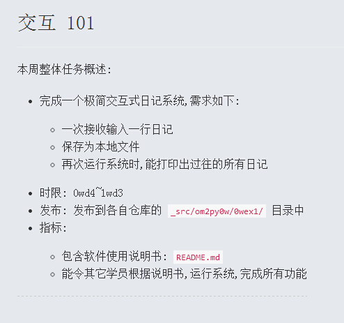
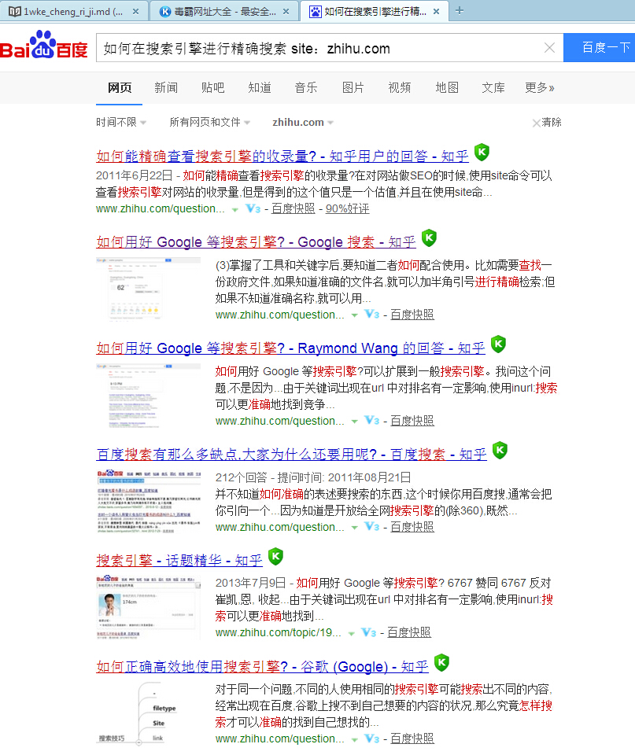
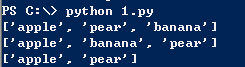

# 1W课程日记

#本周任务

 

#0MOOC Date[10/22/2015]

##进展
- 今天终于顿悟出“坑”的含义：数字、逻辑、计算机 是不会骗你的，只有你的心会骗你
- 在脑子里预演的事情其实完成度只有30%左右
- 实际项目过程中有70%的时间去处理自己和他人遗留下来的问题，当中又有99%的问题是自己造成的
- 觉得自己总是对对的么么哒这样的想法是 # **错的**

#0MOOC Date[10/21/2015]

##进展
#如何使用搜索引
- Google 帮助:
  已保存到百度云盘=====文件：[how to use google]
https://support.google.com/websearch/answer/134479?hl=en
Search operator:
https://support.google.com/websearch/answer/2466433?vid=1-635805120007651578-1473977798
- 无意中发现了这段小教程，然后用上面的方法定点搜索了知乎上面的教程，===〉得到更多的 教程

> 由于每个搜索引擎都有一定的局限性，可以把要搜索的关键词在多个搜索引擎试一下，可能会搜出你意想不到的结果。

>大家对国内的引擎基本都很熟悉，尤其是百度和google，需要搜索同一主题的资料，不同的人所搜出来的结果可能就天差地别了，主要原因在于如下两点。

>1、搜索关键词的选择：举例说明，假如我们要搜索大数据行业发展相关资料，如果我们就在百度上搜索“大数据”，结果非常多，无法进行筛选，可以对关键词进一步界定，如“大数据行业”、“大数据市场规模”、“中国大数据产业”、“大数据技术”、“大数据企业”等等，需要不停地变换搜索关键词，直到查到满意的搜索结果，在查找的过程中可以根据查找结果内容再进行对关键词进行修正，修正有些名称专业表达方式，因为最开始搜索我们表达的不一定准确。

>2、搜索技巧：主要是针对百度、google等搜索引擎一些高级搜索技巧。常用技巧主要有如下几个方面：

>1）文件类型搜索：使用filetype，如在百度或google中键入“filetype:pdf 大数据”搜索出有关大数据内容pdf内容，而且这些文档基本都是可直接下载。还可以变换为其他的如“filetype:doc”、“filetype:ppt”、“filetype:xls”等等，注意其中的冒号为英文的冒号，一定要变换为英文冒号。

>2）定位于哪个网站上搜索：使用site，如在百度或google中键入“大数据空格 site:sina.com”,则在sina.com搜索有关大数据的一些资料信息，这个特别适用针对某些信息可能在哪些网站上出现的一个快速搜索方法，注意冒号也是英文的，网站名称也不用加www。

>3）精确匹配搜索：使用“”，如在百度中键入“大数据行业”，表示搜索“大数据行业”五个必须联在一起的，如果不加“”，搜到的为大数据及行业两个词并列显示结果，没有这么精确匹配。

>4）限制性的网页搜索：使用intitle,如在百度键入“intitie:大数据”，限定于搜索标题中含有“大数据”网页，如果输入“intitie:大数据市场规模”限定于搜索标题中含有“大数据”和“市场规模”的网页。

##难点小结

- 代码照改都没能改对好伤心

##未完成

-  Windows 配置 github 参考教练和优秀同学的课程如下

    http://www.ibowarrow.com/CodingNotes/source/WindowsGithub.html

    https://github.com/OpenMindClub/OMOOC2py/issues/17

还有zoejane的教程

#0MOOC Date[10/19/2015]

##进展
- 预习1W的任务
- 开始做任务刷代码，简直被自己残缺的逻辑吓cry了
- 自学 增加，排序，删除

blog = ["apple", "pear"]
blog.append ("banana")
print blog
blog.sort()
print blog
del blog[1]
print blog

